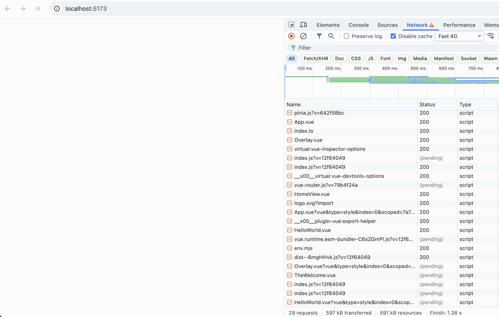
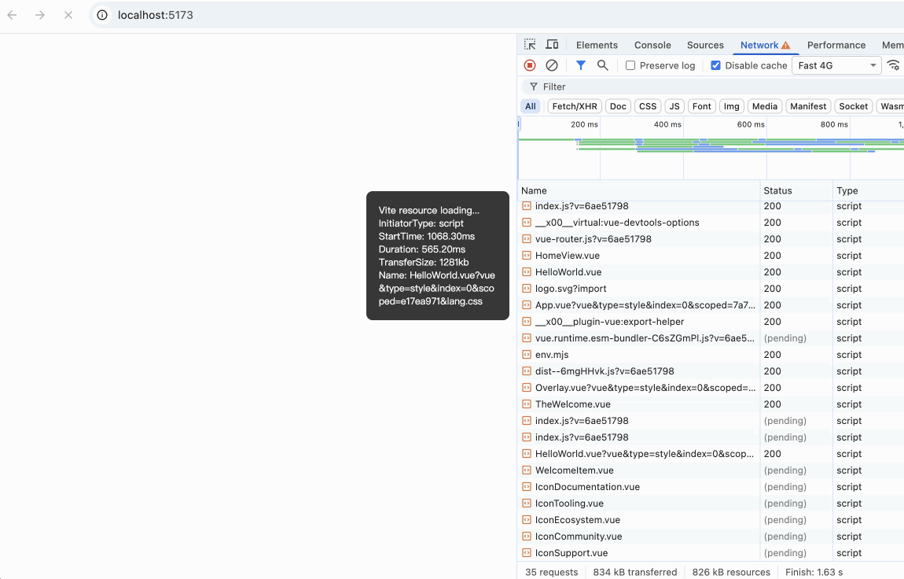
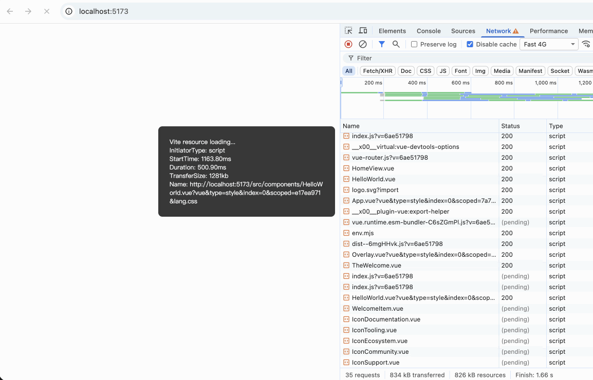
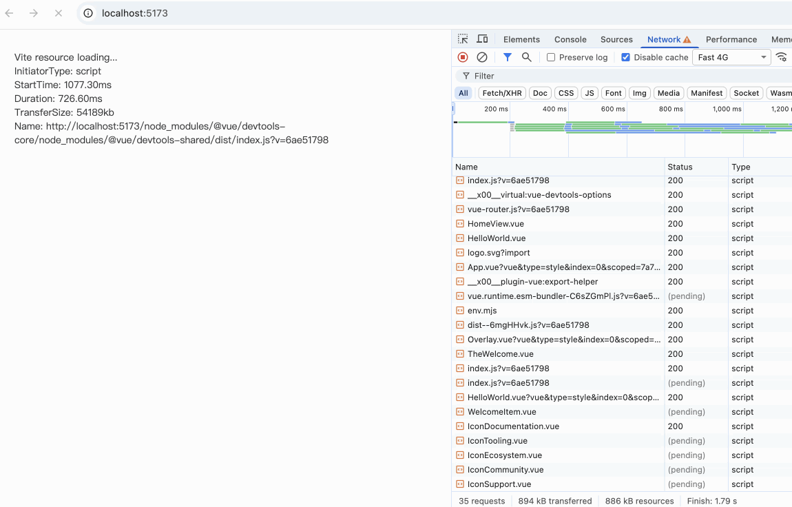

# vite-plugin-white-screen-progress

Show loading progress on page during Vite dev server white screen without opening devtools.


without plugin | ✅ with plugin | ✅ fixed theme | ✅ normal theme
--- | --- | --- | ---
 |  |   |   


## Install

```bash
npm install vite-plugin-white-screen-progress@1.0.1 --save-dev --save-exact
```

## Usage

```js
// vite.config.js
import devServerWhiteScreenProgress from 'vite-plugin-white-screen-progress'

export default {
  // ...
  plugins: [
    // Just enabled in dev server（vite dev），ignore when vite build
    devServerWhiteScreenProgress(),
  ]
}
```

## Config

### Theme

- "fixed-simple": default, fixed in right, simple info
- "fixed": fixed in right, more info 
- "normal": display in a flat layout on the page, not fixed

```js
devServerWhiteScreenProgress({
    theme?: string   // 'fixed-simple' | 'fixed' | 'normal'
})
```

### Custom CSS Style

Custom progress info panel css inline-style,  > theme config
```js
devServerWhiteScreenProgress({
    style?: string
})
```

Example

```js
devServerWhiteScreenProgress({
    style: 'color: blue; background: #fff; padding: 15px; border-radius: 15px'
})
```